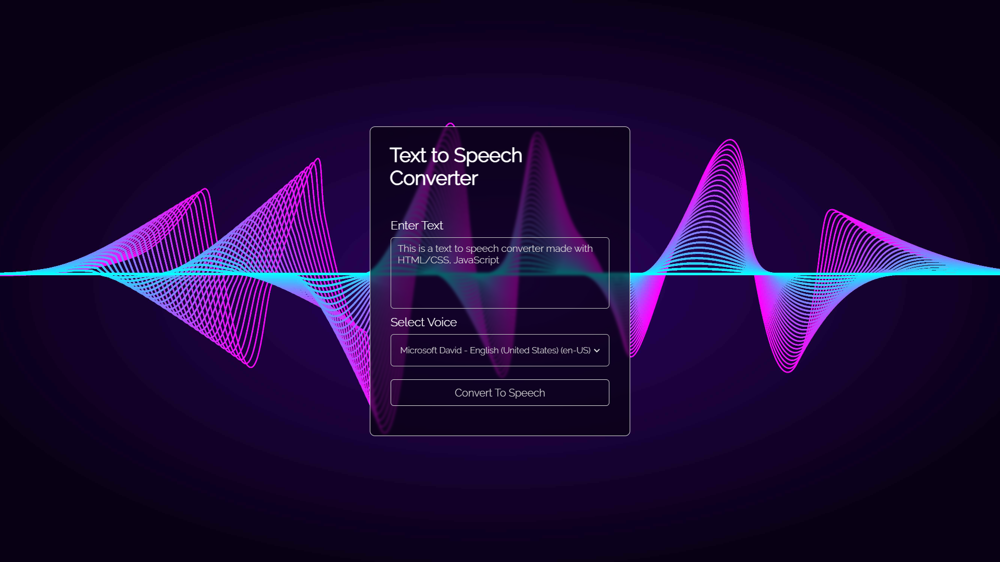

# Text-to-Speech Converter using HTML, CSS, and JavaScript



The Text-to-Speech Converter is a simple web application that utilizes the SpeechSynthesisUtterance API to convert text input into speech output. This project demonstrates how to create a user-friendly interface for entering text and playing it back as speech using modern web technologies.

## Table of Contents

- [Demo](#demo)
- [Features](#features)
- [Getting Started](#getting-started)
  - [Prerequisites](#prerequisites)
  - [Installation](#installation)
- [Usage](#usage)
- [Customization](#customization)
- [Contributing](#contributing)

## Demo

Check out the live demo of the Text-to-Speech Converter: [Demo Link](https://mykusdev.github.io/text-to-speech-converter/)

## Features

- Enter any text you want to convert to speech.
- Adjust the speech rate and pitch according to your preference.
- Play, pause, and resume buttons for controlling the speech playback.
- User-friendly and responsive design.

## Getting Started

Follow these instructions to set up the project locally on your machine.

### Prerequisites

To run this project, you need a web browser with JavaScript enabled.

### Installation

1. Clone the repository or download the ZIP archive.
2. Navigate to the project directory in your terminal.

```bash
cd text-to-speech-converter
```

3. Open the `index.html` file in your preferred web browser.

## Usage

1. Open the web page in your browser.
2. Enter the text you want to convert to speech in the input field.
3. Click the "Convert to Speech" button to listen to the converted speech.
4. Use the "Pause" and "Resume" buttons to control the playback as needed.

## Customization

You can customize the appearance and behavior of the Text-to-Speech Converter to suit your preferences.

- Modify the CSS styles in the `styles.css` file to change the look of the user interface.
- Adjust the JavaScript code in the `script.js` file to add new features or modify existing ones.
- Experiment with different values for speech rate and pitch to find the most natural-sounding speech.

## Contributing

Contributions are welcome! If you find any issues or want to enhance the project, feel free to submit a pull request. Please follow the existing code style and conventions.

1. Fork the repository.
2. Create a new branch: `git checkout -b feature-new-feature`.
3. Make your changes and commit them: `git commit -m 'Add a new feature'`.
4. Push to the branch: `git push origin feature-new-feature`.
5. Submit a pull request detailing your changes.


---
